% [银联大数据提取平台用户操作手册][home]
% by [yqfang](https://github.com/yqfang)

[home]: https://github.com/yqfang/tornado/blob/master/userguide.md

前言
----
这份文件是银联大数据提取平台的操作手册, 希望通过图文说明使用户方便地上手系统

文档使用[Pandoc's markdown][]语法编写, 使用github维护, 欢迎提出[issues][] 来维护手册的版本(请注明: **操作手册**)

[Pandoc's markdown]: http://johnmacfarlane.net/pandoc/demo/example9/pandocs-markdown.html
[issues]: https://github.com/yqfang/tornado/issues

银联大数据提取平台用户操作手册
==============================

系统登录
-------

1. 登录**中国银联大数据平台**

    地址: [http://172.17.252.26:8086/edwweb/index.html](http://172.17.252.26:8086/edwweb/index.html) （请根据实际地址登录）

    如图所示: 

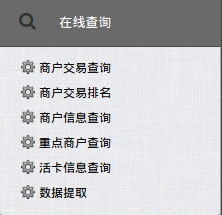

2. 点击左侧菜单: “在线查询” -> ”数据提取“ 

    如图所示: 

新建提取任务
-----------

这里主要说明: 如何新建服务单, 如何添加修改SQL, 如何配置调度, 文件发送等功能

### 进入新建明细提取页面 ###

1. 请确认在**首页**
2. 点击左侧菜单:新建任务 -> 明细提取

    如图所示: 

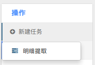

### 填写服务单基本信息　 ###

1. 找到**任务描述**输入框, 点击并输入任务的描述信息(必填)
2. 找到**关联服务单号**输入框, 点击并输入服务单号(选填)

    如图所示: 

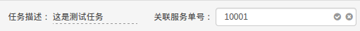

(_注:　点击输入框后，输入完成，点击＇勾＇为确认，点击＇叉＇为取消_)

### 验证数据库连接 ###

1. 请确认左侧**基本信息**标签激活
2. 在**数据库名**选择下拉框选择合适的数据库
    
    如图所示:

    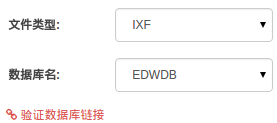

3. 点击下方**验证数据库连接**链接
4. 在弹出的对话框内填写连接数据库的**用户名**和**密码**

例如：　

| 用户名　 |　　　密码　　　|
|--------|----------|
|ppdb_edw|　edwcups8 |

(_请以实际的用户名和密码为准_)

如图所示: 

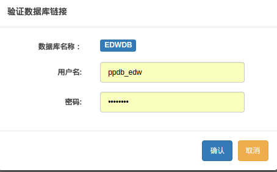

### 构造查询SQL(基本) ###

1. 输入提取表名
    例如: ppap_dpa.tbl_edw_dpa_dim_ins(_请以实际表名为准_)

2. 点击填写表名输入栏**右侧**按钮, 验证表名并得到可选字段
3. 选择**可选字段**和**脱敏字段**
4. 填写约束条件
(_条件开头的 `where` 可加可不加_)

5. 点击**添加SQL**按钮提交查询SQL到服务单

如图所示:

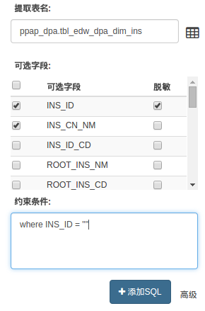

### 构造查询SQL(高级) ###

1. 请确保已经**验证数据库连接**
2. 点击左侧**基本信息**标签右下方的**高级**按钮
3. 在弹出的SQL编辑器内填写SQL
4. 点击**确认**按钮SQL

如图所示:

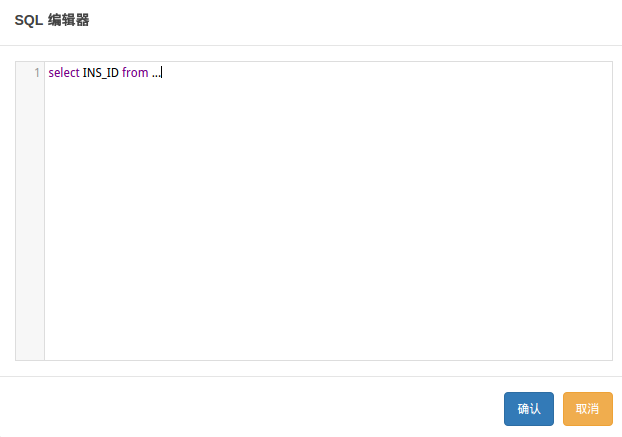

### 配置任务调度 ###

1. 切换左侧表签到**调度辅助**
2. 找到定时调度配置, 点击右侧**添加**按钮

    如图所示:

    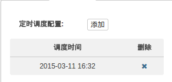

3. 选择定时调度的时间
4. 点击**确定**
    如图所示:

    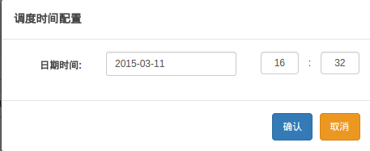

5. 可继续添加多个调度时间

### 配置文件发送 ###

1. 确保左侧**调度服务**标签激活
2. 找到**是否发送**选项, 点击左侧 checkbox 打开文件发送功能
(_注: 默认不发送_)

    如图所示:

    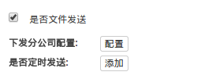

3. 下发分公司配置
    1. 在**下发分公司配置**右侧找到**配置**按钮, 点击打开配置对话框
    2. 选择要发送的分公司
    3. 点击确认

    如图所示:

    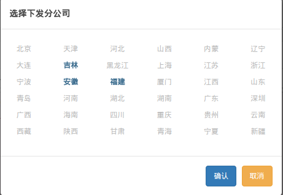

4. 定时发送配置(可选)
    1. 在**是否定时发送**右侧找到**添加**按钮, 点击打开配置对话框
    2. 选择定时发送的时间
    3. 点击确认

    如图所示:

    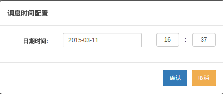

### 修改查询语句 ###

#### 删除重新添加

1. 找到你要修改的查询语句对应行
2. 点击删除列的**删除**按钮
3. 重新添加查询语句(参考[构造查询SQL](#构造查询SQL))

如图所示:
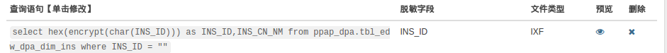

#### 手动修改查询SQL(不建议普通用户使用) ###

1. 找到你要修改的查询语句对应行
2. 点击要修改的查询语句对应的列
3. 修改SQL
4. 保存

如图所示:
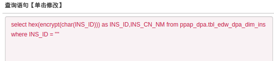

(_注: 手动修改SQL难免出错, 建议一般情况下使用[删除重新添加](#删除重新添加)的策略_)

### 预览查询SQL ###

1. 先确认至少已提交一条查询SQL
2. 找到要预览的查询SQL对应的行
3. 点击**预览**
4. 点击**提交**

(_注: 默认查询10条记录, 可修改_)

如图所示:
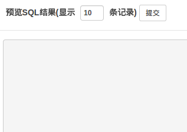

### 执行查询(提交服务单) ###

1. 先确认至少已提交一条查询SQL
2. 确认所有的SQL, 任务描述等信息确认无误
3. 点击底部**执行查询**按钮

### 暂存 ###

1. 点击底部**暂存**按钮
2. 查看暂存请参考: [我的暂存](#我的暂存)

如图所示:
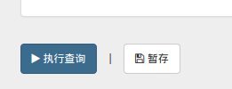

查看历史任务
----------

历史任务是查看已经提交的服务单的入口, 这里可以对**已提交**的服务单进行**查询**, **修改**, **复制**, **查看日志**, **调度配置** 等功能, 本节将对这些功能一一说明

### 查询历史任务 ###

1. 先确认在首页(点击上方菜单:  _小屋子_ 图标)
2. 点击左侧菜单:  _历史任务_ 图标
3. 在右侧页面输入 _任务信息_, _开始时间_, _结束时间_ 等过滤信息
4. 点击**查询**

如图所示:
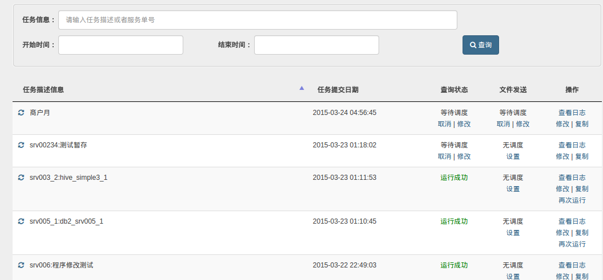

### 配置文件发送 ###

1. 先确保查询到至少一条要配置的历史任务, 且改历史任务**未配置**文件发送
2. 找到欲配置任务对应的行
3. 点击**文件发送**列中的**设置**按钮
4. 在弹出的对话框中配置**[文件发送](#配置文件发送)**和**[定时调度](#配置任务调度)**

### 取消调度 ###

1. 先确保查询到至少一条要配置的历史任务, 且**查询状态**为**等待调度**
2. 点击**查询状态列**的**取消**按钮

### 修改调度时间 ###

1. 先确保[查询](#查询历史任务)到至少一条要配置的历史任务, 且**查询状态**为**等待调度**
2. 点击**查询状态**列的**修改**按钮
3. 可选**立即调度**或者**[定时调度](#配置任务调度)**
4. 点击**确定**

### 查看日志 ###

1. 先确保[查询](#查询历史任务)到至少一条要查看日志的历史任务
2. 点击操作列的**查看日志**按钮
3. 跳转到一个有多个任务调度时间的表格, 默认只显示第一个调度时间的任务的日志信息, 点击每个子任务左上角的`+`, `-` 可折叠或展开各个调度时间的任务日志信息

    如图所示:
    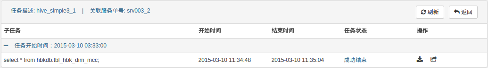

4. 点击子任务对应的**任务状态**列的按钮可查看**成功**或者**错误**的日志信息
5. 点击操作列的`下载`按钮可以下载任务的查询结果
6. 共享文件
    1. 点击`文件共享`按钮
    2. 在弹出的对话框中填写对方的用户名或工号
    3. 点击确认
    
    如图所示:
    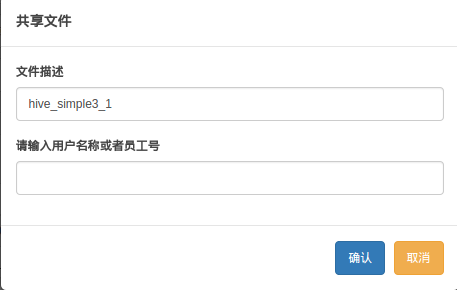

7. 点击右上角的**刷新**按钮可以刷新子任务状态, 点击**返回**可以回到**历史任务**查询页面

### 修改任务 ###

1. 先确保[查询](#查询历史任务)到至少一条要配置的历史任务
2. 点击**操作**列的**修改**按钮
3. 参考[新建提取任务](#新建提取任务)对任务进行修改并重跑

### 复制任务 ###

1. 参考[修改任务](#修改任务)
2. **复制任务**和**修改任务**的区别是:
    - 修改任务是对指定任务的重跑, 重跑结果会覆盖原来的任务
    - 复制任务只是单纯地方便新建新的任务, 原来的任务不受影响

我的暂存
-------

这里存放在[新建提取任务](#新建提取任务)中[暂存](#暂存)的任务

### 查看我的暂存 ###

1. 先确认在首页(点击上方菜单:  _小屋子_ 图标)
2. 点击左侧菜单:  _我的暂存_ 图标
3. 找到要编辑的**暂存任务**, 点击任务描述信息列

如图所示:
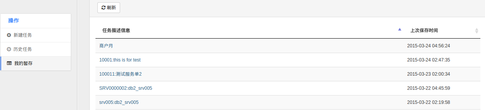

